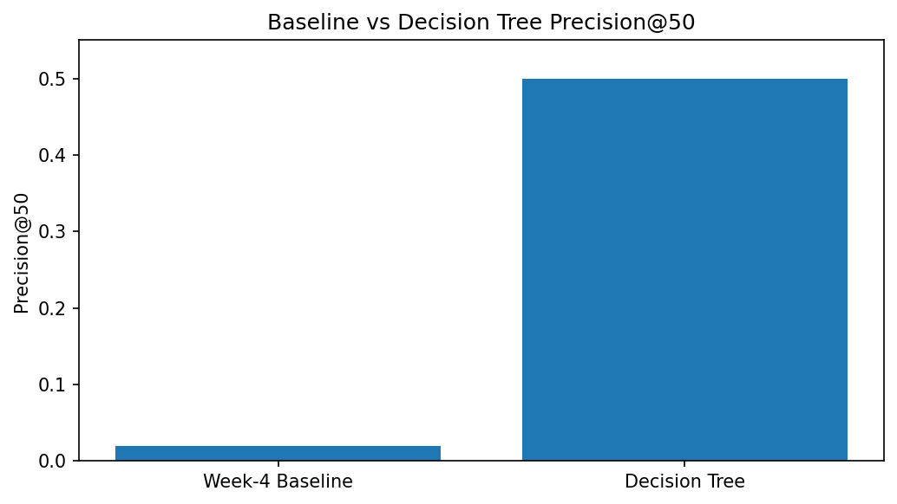

# Capstone Report — Content Refresh Recommendation Using Decision Tree Classification

- **Author:** Angeline de Mesa
- **Lane:** Content Refresh Recommendation
- **Repo:** https://github.com/a-demesa/flyrank-ml
- **Date:** August 2026

---
# Abstract

This project investigates whether machine learning can support FlyRank's content refresh workflow by helping identify webpages that may benefit from editorial review. A Decision Tree classifier was developed using observable Google Search Console metrics from the FlyRank Internship Warehouse dataset. The model was compared with a transparent baseline using grouped validation by client to reduce data leakage. The observed results suggest that search performance metrics can help prioritize webpages for manual review. These findings are intended to support editorial decision-making and should not be interpreted as automated publishing decisions.

---
# Introduction

FlyRank manages large collections of website content, making it difficult for editors to manually determine which pages should be refreshed first. This project explores whether observable search performance metrics can help prioritize webpages for editorial review. By using an interpretable Decision Tree model and honest validation practices, this work aims to provide decision-support that helps content teams focus their efforts while acknowledging the limitations of the available data.

---
## 1. Problem framing

This project supports the decision of which webpages should be reviewed for possible content refresh.

The unit of analysis is an individual webpage in the FlyRank internship dataset.

The output is a ranked recommendation score that prioritizes pages for manual review.

A content editor can use the ranked list to identify pages that may benefit from refreshing.

The cost of a wrong recommendation is spending time updating pages that may not improve search performance or overlooking pages that actually need attention.

Machine learning helps identify patterns across many observations that would be difficult to recognize manually.

---
## 2. Data safety

The project uses the FlyRank Internship Warehouse dataset.

The primary features include:

- gsc_impressions
- gsc_clicks
- gsc_avg_position

The following were intentionally excluded:

- Future performance information
- Label-derived variables
- Client-identifying information
- trend_direction
- trend_pct

Client identifiers were only used for grouped validation and never as model features.

No client names, URLs, or private search queries appear anywhere in this project.

---
## 3. Baseline

The baseline model used a transparent scoring rule based primarily on Google Search Console impressions.

Pages with higher impressions received higher priority for manual review.

The baseline produced a ranked recommendation list that served as the comparison for the Decision Tree model.

Both approaches were evaluated on the same dataset and validation design.

---
## 4. Model / analysis

The final model is a Decision Tree classifier.

This method was selected because it is easy to interpret and produces understandable decision rules.

The model uses:

- gsc_impressions
- gsc_clicks
- gsc_avg_position

The target variable indicates whether a webpage received at least one Google Search click.

Several fields were intentionally excluded to reduce the possibility of data leakage.

---
## 5. Evaluation

Grouped validation by `client_hash_id` was used to reduce leakage between training and testing data.

The Decision Tree was evaluated using the same sampled dataset and validation design as the comparison baseline.

Under grouped-by-client validation, the model produced an observed accuracy of 0.9504 (95.04%) on the sampled dataset.

This result is an observed evaluation result and should not be interpreted as proof that the model will generalize to all clients or future data.

---

## Results

The Decision Tree was compared with the Week-4 baseline using the same sampled test set and Precision@50 metric. Precision@50 was used because the capstone goal is to prioritize webpages for manual review.

| Method | Precision@50 |
|---|---:|
| Week-4 Baseline | 0.02 |
| Decision Tree | 0.50 |

The target base rate in the sampled test set was 0.0845 (8.45%).

The Decision Tree achieved an observed Precision@50 of 0.50, compared with 0.02 for the Week-4 baseline. On this sampled test set, the Decision Tree therefore showed stronger directional prioritization of positive-target pages than the transparent baseline.

These results are observed evaluation results and should not be interpreted as evidence that refreshing a webpage will improve its future search performance.

---
## 6. Interpretation

The Decision Tree relied primarily on impressions, clicks, and average search position.

These features appeared to contain useful information for identifying pages that may deserve review.

The model provides decision-support rather than proof that refreshing content will improve future search performance.

No causal relationship is claimed.

---
## 7. Recommendation

The ranked recommendations should be used as a starting point for editorial review.

Editors should manually verify:

- content quality
- topical relevance
- business importance
- search intent

The recommendations should not be applied automatically.

Confidence in the recommendations is moderate because they were evaluated only on the internship dataset.

---
## 8. Reproducibility

Clone the repository.

Open each notebook under work/notebooks.

Run all notebook cells from top to bottom.

The project uses fixed random seeds where appropriate.

The required Python packages are listed in requirements.txt.

All reported results can be regenerated by executing the notebooks.

---

## Claims checklist

- All claims use observed, measured, or decision-support language.
- No causal claims are made.
- No client-identifying information appears.
- Metrics were reproduced from notebook executions.
- Recommendations require human review before action.
  
---

## Acknowledgments & Data Credit

Built on the FlyRank ML Internship dataset.

Data source: [FlyRank](https://flyrank.ai)
